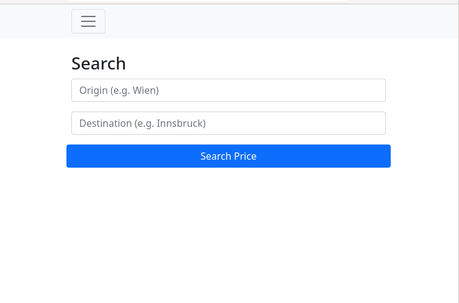

# oebb-ticket-price
TODO
A minimal example of a Flask web application using htmx and Bootstrap for the front end.

## Components
The application uses the following components.
1. [Flask](https://flask.palletsprojects.com) for the backend
2. [htmx](https://htmx.org/) for asynchronous HTTP requests and [server-sent events](https://developer.mozilla.org/en-US/docs/Web/API/Server-sent_events)
3. [Bootstrap](https://getbootstrap.com/) for front end layout

## File Structure
TODO
- ```static/``` contains the Bootstrap and htmx assets.
- ```templates/``` contains the Jinja2 templates used by Flask.
- ```app.py``` is the Flask application's implementation

## Run
To run the application locally follow these steps.

1. Create and activate a virtual environment
    ```
    python -m venv venv
    source venv/bin/activate
    ```
2. Install dependencies
    ```
    pip install -r requirements.txt
    ```
3. Adapt the config, either by changing the contents in ```settings.py``` or by pointing the environment variable ```APPLICATION_SETTINGS``` to an alternative file.
4. Run the app
    ```
    export FLASK_ENV=development
    export FLASK_APP=app
    flask run
    ```
5. Open in your browser: http://localhost:5000

## Live Demo
A live version can be reached at https://train.sad.bz



## Deploy
```oebb-ticket-price.service``` and ```wsgi.py``` can be used to deploy the application using Gunicorn. To use nginx as a proxy the following config snippet can be used inside a ```server``` section.

```
location / {
   include proxy_params;
   proxy_pass http://unix:/var/www/oebb-ticket-price/oebb-ticket-price.sock;
   proxy_buffering off;
}
```

